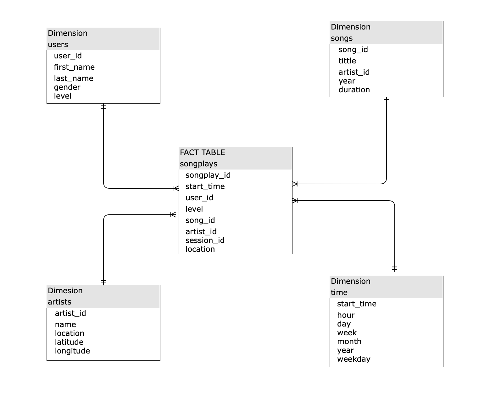

# Project 1: Sparkify Data Modeling with Postgres

This is the first project of Udacity Engineering Nanodegree, this project consist of modeling and creating a Sparkify music app data base through an ETL process.

## Context

For Sparkify it is important to work with the data generated by the platform for its subsequent analysis, for this Sparkify has decided to improve its scheme and treatment of its data, for this the following modeling work has been carried out with a database based on Postgres SQL data base.

## How to run Python scripts

To build the database you must first run the python script (with python 3, the newest version possible) `create_tables.py`. To load the data in the database run `etl.py` script.

## Project files structure 

- `data`, folder that contain the JSON format files.
- `create_tables.py`, script that build the database.
- `etl.ipynb`, Jupyter notebook that was used for the ETL process to make the final script for uploading the files to the database.
- `etl.py`, script for make the ETL process.
- `sql_queries.py`, this script contain all the sql queries and commands to build the data base.
- `test.ipynb`, Jupyter notebook to test if the data base was correctly build.
- `README.md`, current file, provides information about this project.

## Database design and ETL pipeline

The database has build with an Fact table named `songplays` and four dimensions named, `users`, `artists`, `songs` and `time`.  The star schema can be seen below.

### ETL pipeline

- The ETL pipeline consist on extract data originally stored in JSON format under /data/song_data.
- Transforming it into two datasets ("song" and "log").
- With some values from the songs dataset the songs and artists table are built.
- With log dataset was possible to make time table, it was build filtering the row page with the value 'NextSong'.
- To separate the timestrap must to use the ts row and run datetime pandas function.
- The users table was built using some rows from the log dataframe.
- Finally to build the songplays table, with a sql query obtain songid and artistid, and using log dataframe can obtein the rest of the values to build the table.

### Authors

Yerko Gallardo.
